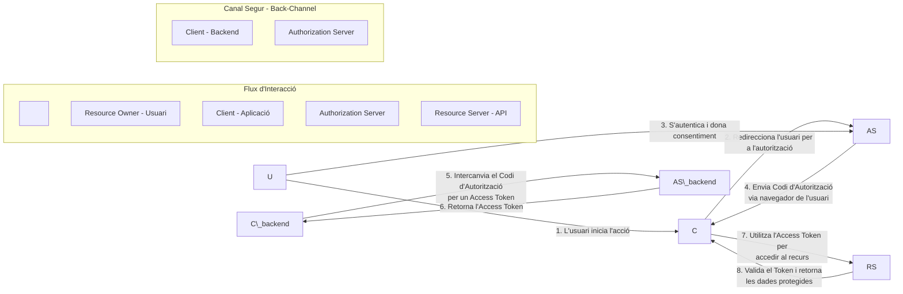

Aquí tienes el contenido del PDF transformado a formato Markdown, siguiendo estrictamente tus indicaciones sobre la estructura, tablas, diagramas Mermaid y el tratamiento detallado de las imágenes con descripciones técnicas.

\*\*\*

\# Sistemes Distribuïts - PAC 2

\*\*Alumne:\*\* Abel Bolance Olivares

\[TOC]

---

\## Pregunta 1: Disseny de Plataforma Distribuïda

Proposeu el disseny d’una plataforma distribuïda, escalable i d’alt rendiment que permeti publicar, emmagatzemar i processar fluxos de dades en temps real. La plataforma ha de seguir el model de publicació/subscripció.

\*\*Proposta General:\*\*

La meva proposta és una plataforma distribuïda de publicació/subscripció dissenyada per l’alta disponibilitat i consistència.

\*   \*\*Replicació:\*\* Sistema de replicació passiva (mestre-esclau).

\*   \*\*Elecció de líder:\*\* Dinàmica amb l’algoritme "Bully".

\*   \*\*Ordre i Comunicació:\*\* El líder garanteix l’ordre mitjançant "atomic multicast".

\*   \*\*Concurrència:\*\* Control pessimista (\*pessimistic method\*).

\*   \*\*Seqüenciació:\*\* Rellotges lògics ordenats.

\### a) Coordinació i consens

\*   \*\*Algorisme d’exclusió mútua distribuïda:\*\* Important per coordinar l’accés a recursos compartits evitant condicions de carrera i inconsistència en les dades.

\*   \*\*Algoritme "Bully":\*\* Adequat per un sistema síncron. Permet elegir de forma fiable un nou líder quan l’actual falla, garantint que el procés amb l’identificador més alt assumeix el rol. El líder actua com a seqüenciador global.

\*   \*\*Multicast atòmic:\*\* Assegura que tots els nodes correctes rebin els mateixos missatges. L'ordenació total garanteix que es processin en el mateix ordre.

\### b) Replicació i tolerància a fallades

\*   \*\*Importància:\*\* Vital per aconseguir alta disponibilitat i rendiment. Permet continuar el servei si cauen nodes.

\*   \*\*Tipus:\*\* Replicació passiva (mestre-esclau).

\*   \*\*Comunicació:\*\* Síncrona entre rèpliques. Garanteix una visió consistent dels nodes actius.

\*   \*\*Justificació:\*\* La replicació passiva és més adient per sistemes que requereixen alta consistència en temps real. (Gossip, Bayou o Coda estan més orientats a sistemes desconnectats).

\### c) Gestió de la concurrència i ordenació

\*   \*\*Concurrència:\*\* Pessimista. Ideal per a sistemes on les operacions són majoritàriament actualitzacions (publicació de missatges). Detecta conflictes en el moment de l'accés.

\*   \*\*Ordenació:\*\* Rellotges lògics ordenats. El temps físic no és fiable en sistemes distribuïts.

\### d) Comparativa amb Apache Kafka

| Característiques | Sistema proposat | Apache Kafka |

| :--- | :--- | :--- |

| \*\*Coordinació i consens\*\* | Utilitza un algorisme "Bully". El líder és responsable de la coordinació total. | Depèn d'un sistema de consens robust amb el seu propi protocol Kraft. Un node "controller" gestiona l'estat. |

| \*\*Replicació\*\* | Replicació passiva (mestre-esclau). | Un model de log replicat i en particions. |

| \*\*Gestió concurrència\*\* | Ordre total mitjançant un seqüenciador central. | Garanteix l'ordre total només dins de cada partició. |

| Sistema | Avantatges | Inconvenients |

| :--- | :--- | :--- |

| \*\*Sistema proposat\*\* | La garantia d'ordre total simplifica el disseny. | El líder pot convertir-se en un coll d'ampolla. |

| \*\*Apache Kafka\*\* | L'arquitectura basada en particions és més escalable. Càrrega dividida en múltiples líders. | La falta d'ordre total global. |

---

\## Pregunta 2: Comparativa de Conceptes

\### a) Autenticació: Needham-Schroeder vs Kerberos

| Anàlisi | Needham-Schroeder | Kerberos |

| :--- | :--- | :--- |

| \*\*Seguretat (Atacs)\*\* | Vulnerable a atacs de repetició. | Segur davant atacs de repetició. Ho soluciona mitjançant "timestamps". |

| \*\*Eficiència comunicació\*\* | Menys eficient per a sessions múltiples. | Molt eficient per a sessions múltiples. |

| \*\*Implementació\*\* | Conceptualment més simple. | Molt més complex d'implementar i gestionar. |

\### b) Serveis altament disponibles: Gossip vs Bayou vs Coda

| Anàlisi | Gossip | Bayou | Coda |

| :--- | :--- | :--- | :--- |

| \*\*Tolerància i disponibilitat\*\* | Molt alta. Client comunica amb qualsevol gestor disponible. | Dissenyat per entorns mòbils. Alta disponibilitat fins i tot desconnectat. | Molt alta. Utilitza grups d'emmagatzematge de volum disponible (AVSG). |

| \*\*Consistència\*\* | Segells de temps vectorial (\*timestamp vector\*). | Transformació operacional. Comprovació de dependències i fusió per resoldre conflictes. | Vectors de versió de Servidor (CVV) per detectar conflictes. |

| \*\*Tipus d'aplicacions\*\* | Baixa latència de lectura (notícies, xarxes socials). | Aplicacions compartides (calendaris, editors text). | Sistemes d'arxius distribuïts accessibles des de diferents dispositius. |

\### c) Control de concurrència: Google Docs vs Wikipedia

| Anàlisi | Google Docs | Wikipedia |

| :--- | :--- | :--- |

| \*\*Gestió concurrència\*\* | Optimista i en temps real. | Optimista i basat en sessions. |

| \*\*Resolució conflictes\*\* | Automàtica a nivell de servidor. | Manual a nivell d'usuari. |

| \*\*Consistència\*\* | Consistència eventual. | Consistència forta. |

| \*\*Latència\*\* | Molt baixa. | Molt Alta. |

---

\## Pregunta 3: Protocols de Seguretat

\### a) Funcionament del protocol OAuth 2.0

OAuth 2.0 és un protocol per a la delegació d'autorització. Permet que un Client accedeixi a recursos d'un Usuari (Owner) allotjats en un Resource Server sense compartir credencials, basant-se en tokens.

!\[Flux del protocol OAuth 2.0](figure\_001.png)

> \*\*Figure 001: Diagrama de flux i rols en OAuth 2.0\*\*

>

> \*\*Descripció Tècnica:\*\* La imatge mostra un diagrama de blocs funcional que representa el flux d'autorització \*Authorization Code Grant\*. Es distingeixen quatre actors principals: el Client (Backend), l'Usuari (Resource Owner), el Servidor d'Autorització i el Servidor de Recursos (API). 

>

> El procés es divideix en dos canals:

> 1.  \*\*Flux d'interacció (Front-channel):\*\* L'usuari inicia l'acció, el client redirigeix al navegador cap al Servidor d'Autorització, l'usuari s'autentica i atorga consentiment. El servidor retorna un Codi d'Autorització.

> 2.  \*\*Canal Segur (Back-channel):\*\* El Client (Backend) intercanvia aquest codi directament amb el Servidor d'Autorització per obtenir un \*Access Token\*. Finalment, utilitza aquest token per fer peticions validades al Servidor de Recursos (API).

\*(Nota: Podeu veure el codi Mermaid d'aquest diagrama a l'Annex al final del document).\*

\### b) Protocol Needham-Schroeder

La figura següent mostra la interacció per establir una clau de sessió segura ($K\_{A,B}$) utilitzant un servidor de confiança (KDC).

!\[Interacció del protocol Needham-Schroeder](figure\_002.png)

> \*\*Figure 002: Diagrama de seqüència de Needham-Schroeder\*\*

>

> \*\*Descripció Tècnica:\*\* Es presenta un diagrama de seqüència temporal (MSC) que involucra tres entitats: Alice (A), el Centre de Distribució de Claus (KDC) i Bob (B).

>

> \*   \*\*Pas 1:\*\* Alice envia un nonce ($R\_{A1}$) i la identitat de Bob al KDC.

> \*   \*\*Pas 2:\*\* El KDC respon xifrant amb la clau d'Alice ($K\_{A,KDC}$). El missatge conté el nonce original, la identitat de Bob, la nova clau de sessió ($K\_{A,B}$) i un \*Ticket\* xifrat amb la clau de Bob ($K\_{B,KDC}$).

> \*   \*\*Pas 3:\*\* Alice envia el \*Ticket\* (que no pot desxifrar) a Bob juntament amb un desafiament xifrat ($K\_{A,B}(R\_{A2})$).

> \*   \*\*Pas 4:\*\* Bob desxifra el ticket, obté la clau de sessió, desxifra el desafiament d'Alice i respon amb un nonce transformat ($R\_{A2}-1$) i un de propi ($R\_B$).

> \*   \*\*Pas 5:\*\* Alice confirma la connexió retornant el nonce de Bob transformat ($R\_B-1$).

\*\*Taula d'interacció detallada:\*\*

| Missatge | Interacció | Explicació |

| :--- | :--- | :--- |

| \*\*1\*\* | $A \\rightarrow KDC: R\_{A1}, A, B$ | Alice sol·licita connexió amb Bob enviant identitats i un nonce per evitar atacs de repetició. |

| \*\*2\*\* | $KDC \\rightarrow A: E\_{K\_A}(R\_{A1}, B, K\_{AB}, Ticket\_B)$ | El KDC genera la clau de sessió i el Ticket. Tot xifrat per Alice. Alice verifica que $R\_{A1}$ coincideix. |

| \*\*3\*\* | $A \\rightarrow B: Ticket\_B, E\_{K\_{AB}}(R\_{A2})$ | Alice envia el Ticket a Bob (que només Bob pot llegir) i un desafiament xifrat amb la nova clau. |

| \*\*4\*\* | $B \\rightarrow A: E\_{K\_{AB}}(R\_{A2}-1, R\_B)$ | Bob desxifra el Ticket, obté $K\_{AB}$, resol el desafiament d'Alice ($R\_{A2}-1$) i proposa el seu propi desafiament ($R\_B$). |

| \*\*5\*\* | $A \\rightarrow B: E\_{K\_{AB}}(R\_B-1)$ | Alice resol el desafiament de Bob, completant l'autenticació mútua (Handshake). |

---

\## Pregunta 4: Transaccions (2PC vs 3PC)

\### a) Anàlisi Two-Phase Commit (2PC) vs Three-Phase Commit (3PC)

\*   \*\*2PC:\*\* És el més utilitzat. Requereix dues rondes. Problema principal: Bloqueig. Si el coordinador falla després que un participant voti "Sí", el participant queda bloquejat (estat incert) mantenint recursos ocupats.

&nbsp;   \*   \*Exemple:\* Middleware CORBA.

\*   \*\*3PC:\*\* Dissenyat per solucionar el bloqueig del 2PC afegint una fase extra (PreCommit). Això permet que, en cas de fallada del coordinador, els participants puguin consensuar un resultat (timeout) sense quedar bloquejats indefinidament.

&nbsp;   \*   \*Exemple:\* Difícil de trobar en sistemes comercials purs degut a la major latència de xarxa (3 rondes).

\### b) Rendiment del protocol 2PC

El rendiment es mesura pel temps de latència per completar la transacció i la durada dels bloquejos.

!\[Fases del protocol 2PC](figure\_003.png)

> \*\*Figure 003: Diagrama d'estats i flux del Two-Phase Commit\*\*

>

> \*\*Descripció Tècnica:\*\* La imatge il·lustra el funcionament del protocol 2PC.

> \*   \*\*Part superior:\*\* Descripció textual de la Fase 1 (Voting phase) on s'envia `canCommit?` i la Fase 2 (Completion phase) on s'envia `doCommit` o `doAbort`.

> \*   \*\*Part inferior:\*\* Un diagrama d'interacció entre el Coordinador i un Participant.

>     \*   El Coordinador passa pels estats: `prepared to commit` $\\rightarrow$ `committed` $\\rightarrow$ `done`.

>     \*   El Participant passa pels estats: `prepared to commit` (incert) $\\rightarrow$ `committed`.

>     \*   Es mostren els missatges clau: `canCommit?`, `Yes/No`, `doCommit`, `haveCommitted`.

\*\*Càlcul de rendiment (4 transaccions):\*\*

1\.  \*\*Totes fan commit (T1, T2, T3, T4):\*\*

&nbsp;   \*   Rendiment = Suma del temps de les 4 transaccions completant les dues fases.

&nbsp;   \*   Bloqueig mínim però existent (RTT de xarxa per 2 fases).

2\.  \*\*Dues fan abort (T1, T2 commit; T3, T4 abort):\*\*

&nbsp;   \*   Rendiment = Temps (T1 + T2 complets) + Temps (T3 + T4 fase 1 + notificació abort).

&nbsp;   \*   L'escenari amb aborts allibera recursos més ràpidament, ja que el coordinador envia l'abort immediatament al rebre un "No" o detectar una fallada en la precondició, estalviant part de la segona fase completa o esperes.

---

\## Pregunta 5: Rellotges Lògics i Vectorials

\### a) Rellotges de Lamport (Resultats)

\*\*Escenari 1:\*\*

!\[Escenari 1 Lamport](figure\_004.png)

> \*\*Figure 004: Diagrama espai-temps Escenari 1 (Lamport)\*\*

>

> \*\*Descripció Tècnica:\*\* Diagrama amb 4 processos (P1-P4). Les línies horitzontals representen el temps i les fletxes missatges. Els punts són esdeveniments.

> \*   Es segueix la regla $L(e) = L(e) + 1$ per esdeveniments locals.

> \*   Per recepció de missatge: $L(e) = \\max(L\_{local}, L\_{missatge}) + 1$.

> \*   \*\*Resultat final:\*\* P1=11, P2=9, P3=10, P4=7.

\*\*Escenari 2:\*\*

!\[Escenari 2 Lamport](figure\_005.png)

> \*\*Figure 005: Diagrama espai-temps Escenari 2 (Lamport)\*\*

>

> \*\*Descripció Tècnica:\*\* Similar a l'anterior però amb una topologia de missatges diferent. Es pot observar com el temps lògic "salta" en rebre missatges d'un procés amb un rellotge més avançat (ex: P1 envia a P2).

> \*   \*\*Resultat final:\*\* P1=10, P2=6, P3=9, P4=9.

\### b) Rellotges Vectorials (Resultats)

Els vectors s'inicialitzen a $(0,0,0,0)$.

\*\*Escenari 1:\*\*

!\[Escenari 1 Vectors](figure\_006.png)

> \*\*Figure 006: Diagrama espai-temps Escenari 1 (Vectors)\*\*

>

> \*\*Descripció Tècnica:\*\* S'utilitzen vectors de mida 4 $\[v\_1, v\_2, v\_3, v\_4]$.

> \*   Regla d'actualització: En enviar/event intern, s'incrementa l'índex propi $v\_i = v\_i + 1$. En rebre, es fa el màxim component a component entre el vector local i el rebut, i després s'incrementa el propi.

> \*   \*\*Estat Final:\*\*

>     \*   P1: (10, 2, 3, 6)

>     \*   P2: (7, 5, 3, 3)

>     \*   P3: (8, 2, 6, 4)

>     \*   P4: (1, 0, 0, 6)

\*\*Escenari 2:\*\*

!\[Escenari 2 Vectors](figure\_007.png)

> \*\*Figure 007: Diagrama espai-temps Escenari 2 (Vectors)\*\*

>

> \*\*Descripció Tècnica:\*\* Mostra la propagació de causalitat. Els valors finals reflecteixen el coneixement transitiu que cada procés té sobre els esdeveniments dels altres.

> \*   \*\*Estat Final:\*\*

>     \*   P1: (10, 1, 1, 8)

>     \*   P2: (1, 4, 2, 3)

>     \*   P3: (4, 1, 7, 6)

>     \*   P4: (7, 1, 1, 8)

\### c) Relació "va ocórrer abans"

Amb \*\*rellotges vectorials\*\* es pot determinar si dos esdeveniments són concurrents o si tenen una relació causal només observant els seus segells de temps (comparant vector a vector). Amb Lamport, si $L(a) < L(b)$, no podem assegurar que $a \\rightarrow b$ (podrien ser concurrents), només sabem que no és possible que $b \\rightarrow a$.

\### d) Amazon Dynamo i Rellotges Vectorials

Dynamo utilitza rellotges vectorials per detectar conflictes de versions d'una mateixa dada (clau-valor) actualitzada concurrentment en diferents rèpliques.

Quan es detecta un conflicte (branques divergents en el vector), Dynamo no el resol automàticament; delega la \*\*reconciliació semàntica\*\* al Client (l'aplicació), que és qui entén la lògica de negoci per fusionar les dades.

---

\## Referències

\*   Distributed Systems Concepts and Design, Fifth Edition.

\*   Kafka 4.1 Documentation.

\*   Protocol Kerberos (RFC 4120).

\*   Needham-Schroeder Public key protocol (NSPK).

\*   Amazon Dynamo (ACM Paper).

\*   OAuth.net.

---

\## Annex: Diagrama Mermaid (Exercici 3.A)

Codi font del diagrama utilitzat a la Pregunta 3a:

